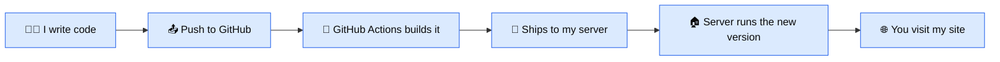
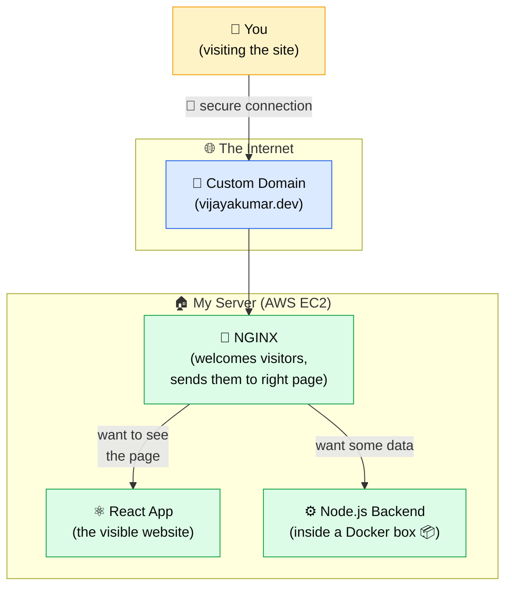
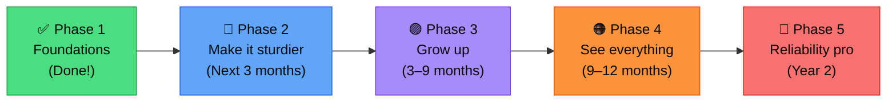
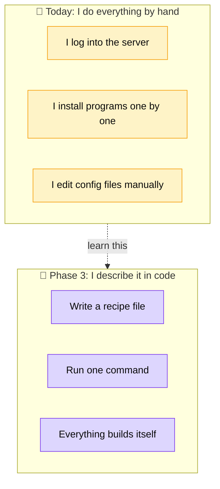
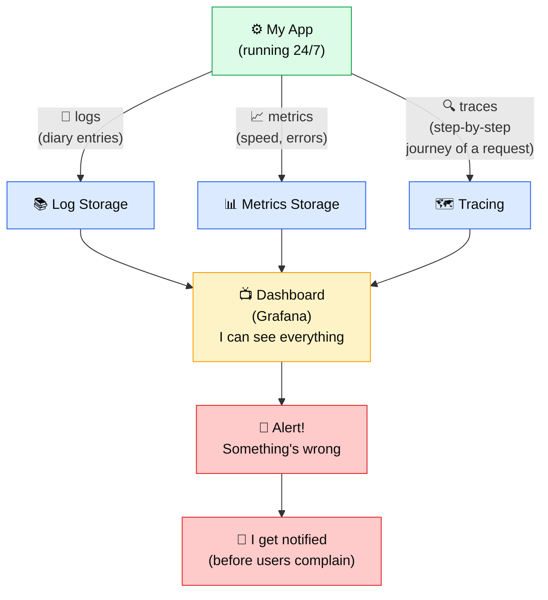
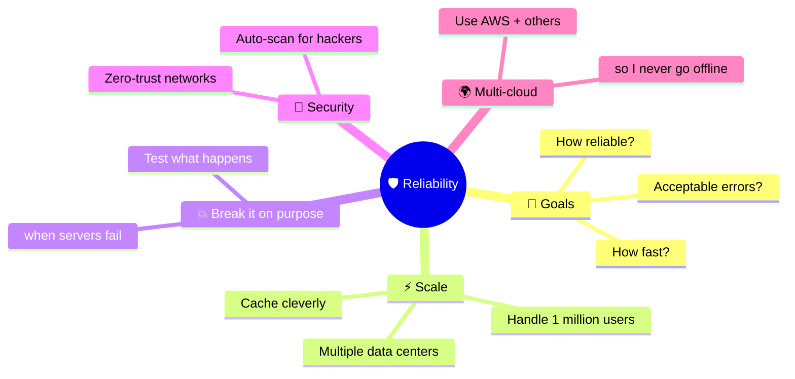

# 🚀 DevOps Roadmap — Made Simple

> **Who this is for:** Anyone curious about what I'm learning in DevOps — friends, family, recruiters, future-me.
> No jargon. If a word sounds technical, there's a 👉 plain-English version next to it.

---

## 🍕 The "Pizza Shop" analogy

Think of running a website like running a **pizza shop**:

| Pizza shop                       | Website / DevOps                                            |
| -------------------------------- | ----------------------------------------------------------- |
| 🏪 The shop itself               | A **server** — a computer on the internet that hosts your site |
| 🍕 The recipe                    | Your **code** (React + Node.js)                             |
| 📦 A delivery box (with everything) | **Docker** — packs the recipe so it tastes the same anywhere |
| 🚪 The host who seats customers  | **NGINX** — sends each visitor to the right page            |
| 🗺️ The address on Google Maps    | **Custom domain** (e.g. `yourname.com`)                     |
| 🔐 A locked door (only real customers) | **HTTPS / SSL** — encrypts everything                  |
| 🛵 The delivery driver           | **GitHub Actions** — auto-ships new versions to the shop    |
| 🤫 A spare oven you swap in      | **Zero-downtime** — no one notices the change               |

If you understand the pizza shop, you understand my DevOps work.

---

## 🗺️ The big picture

That whole chain happens **automatically** every time I make a change. No manual steps. That's the magic of DevOps.

---

## 🏗️ How my website actually runs today

**In plain words:** A visitor types my address → the internet finds my server → NGINX (the doorman) decides whether they want the website or some data → sends them to the right place. Secure padlock 🔒 the whole way.

---

## ✅ What I've already learned (Phase 1 — 2026)

Eleven things, explained simply:

### ☁️ 1. AWS EC2 server setup
> 👉 I rented a small computer from Amazon that runs 24/7 so my website is always online.

### 🐧 2. Linux & NGINX configuration
> 👉 The server runs Linux (a free, reliable operating system). NGINX is the program that decides who sees what.

### 🌍 3. Custom domain + HTTPS SSL
> 👉 Bought a custom address (like `myname.com`) and added a padlock 🔒 so all data is encrypted.

### ⚛️ 4. React frontend deployment
> 👉 Took my visible website (the React part) and put it on the server so people can see it.

### ⚙️ 5. Node.js backend deployment
> 👉 Put the "brain" of the site (Node.js — the part that handles data) on the server too.

### 🚪 6. NGINX reverse proxy
> 👉 NGINX acts like a smart receptionist — visitor wants the page? Send to React. Wants data? Send to Node.js.

### 🤖 7. GitHub Actions CI/CD pipeline
> 👉 A robot that watches my code. Every time I save changes, it auto-tests them and ships them to the server. No clicking buttons.

### 🔑 8. SSH-based secure deployments
> 👉 The robot uses a secret digital key to log into the server safely. Like a hotel key card, only digital.

### ♻️ 9. Zero-downtime deployment
> 👉 When updating, I swap the running website with the new version *while it's still running* — visitors don't even notice.

### 📦 10. Dockerized backend services
> 👉 Wrapped the Node.js code in a "Docker box" — a sealed package that has everything it needs to run. Works the same on my laptop and on the server.

### 🔄 11. Automated production deployments
> 👉 The whole pipeline — test → build → ship → restart — runs **by itself** when I push code. No manual work.

---

## 📅 What's next — visual journey

---

## 🔵 Phase 2 — Make it sturdier (next 3 months)

Picture this: my pizza shop works, but **what if the oven catches fire? What if I lose the recipe book?** Phase 2 is about safety nets.

| What I'll learn         | In plain words                                                              |
| ----------------------- | --------------------------------------------------------------------------- |
| 🧩 **Docker Compose**   | Instead of one Docker box, run several connected boxes (web + database + cache) like a connected kitchen |
| ❤️ **Health checks**    | The server pings itself every minute — "you still alive?" — and auto-restarts if not |
| 🔐 **Secrets management** | Stop putting passwords in files. Use a special vault.                     |
| 💾 **Database backups** | Every night at midnight, save a copy of the data somewhere safe — like a fireproof safe |
| 📊 **Basic monitoring** | Get a phone alert if the site goes down (instead of finding out from a tweet) |
| ☁️ **AWS S3 + Route 53** | Use Amazon's pro tools for storing files and managing my domain          |

---

## 🟣 Phase 3 — Grow up (3–9 months)

**Imagine:** my pizza shop is popular. I need to open a second branch. And a third. And manage them all without flying between cities.

**Key tools:**
- 🧱 **Terraform** → write infrastructure as a recipe file. Run it → AWS creates everything automatically.
- 🚢 **AWS ECS** → instead of one server, run apps across many servers automatically. Amazon manages the boring stuff.
- ⚖️ **Load balancer** → if 1,000 visitors arrive at once, spread them across multiple servers so nothing crashes.

---

## 🟠 Phase 4 — See everything (9–12 months)

**Imagine** running a restaurant blindfolded. That's deploying without monitoring. Phase 4 is putting cameras and sensors everywhere.

**The goal:** I find out problems *before* my users do.

---

## 🔴 Phase 5 — Reliability pro (Year 2 and beyond)

This is the level where DevOps becomes **Site Reliability Engineering (SRE)** — fancy term for "making sure things basically never break".

**What it means in plain words:**
- I'll have **specific reliability targets** ("99.9% uptime")
- I'll **simulate disasters** in safe environments to practice recovering
- I'll **plan for breaches** before they happen
- The whole platform will **heal itself** in most cases

---

## 🚫 Things I'm intentionally skipping (for now)

Some popular DevOps tools sound exciting but aren't useful for me yet. Adding them now = wasting time.

| Tool                     | Why I'm not learning it yet                                            |
| ------------------------ | ---------------------------------------------------------------------- |
| ☸️ **Kubernetes**         | Overkill for one website. Like buying a forklift to carry a sandwich.  |
| 🕸️ **Service mesh**       | Useful only when you have 50+ services talking to each other.          |
| ☁️☁️ **Multi-cloud**      | "Just in case" is not a good reason. I'll master AWS first.            |
| 🔬 **Custom monitoring** | Free tools already do 90% of what I need.                              |

---

## 💡 My DevOps rules of thumb

1. **Boring is good.** A deploy should feel like nothing. If I'm nervous, the pipeline is missing a check.
2. **A backup that's never been restored is not a backup.** I will practice restoring them.
3. **If I can't sketch the system on a napkin, it's too complicated.**
4. **Learn the why, not just the tool.** Tools change every year. Concepts don't.
5. **Measure before you optimize.** You can't fix what you can't see.

---

## 📖 Tiny glossary

| Word                  | Plain meaning                                              |
| --------------------- | ---------------------------------------------------------- |
| **Server**            | A computer on the internet that's always on.               |
| **Deploy**            | The act of putting new code on the server so users see it. |
| **CI/CD**             | Automation that builds + ships code every time it changes. |
| **Container / Docker** | A sealed box with code + everything it needs to run.       |
| **Pipeline**          | The sequence of steps: test → build → ship.                |
| **DNS**               | The internet's phone book. Converts `name.com` to IP addresses. |
| **SSL / HTTPS**       | The padlock 🔒 in your browser bar. Means data is encrypted. |
| **Reverse proxy**     | A traffic director that sits in front of your app.         |
| **IaC** (Infra as Code) | Describing servers in a recipe file instead of clicking buttons. |
| **Monitoring**        | Tools that watch your app 24/7 and alert you if it's sick. |
| **SRE**               | The discipline of keeping things reliable at scale.        |

---

## 🌱 Why I'm sharing this

I'm a Fullstack Developer who **started DevOps in 2026**. This roadmap is my honest learning plan.

If you're a recruiter — you can see exactly what I know vs. what I'm working toward. No fluff.
If you're a friend — now you actually understand what I do all day. 😄
If you're a fellow developer — feel free to steal this plan.

---

_Last updated: 2026-05-16_
